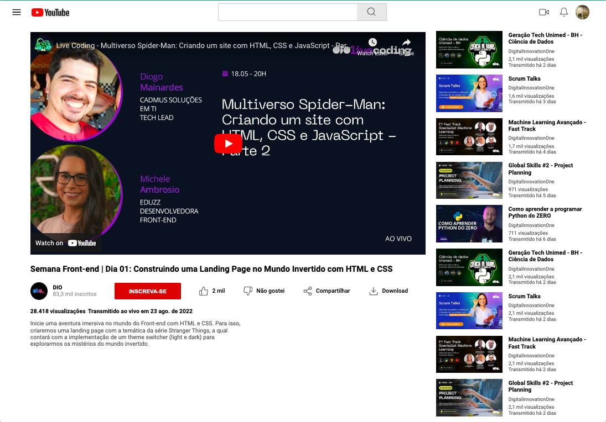

# Clonagem da Página do YouTube

Este projeto foi desenvolvido como parte do desafio da Trilha de CSS da DIO. O objetivo principal foi aplicar os conceitos aprendidos em CSS, especialmente sobre **Flexbox**, para recriar a interface principal da página do YouTube.

## Objetivos do Projeto
- Reproduzir o layout principal da página do YouTube.
- Aplicar o **Flexbox** para posicionar, alinhar e distribuir os componentes da página.
- Desenvolver habilidades em CSS para estilização e controle de layout.
  

